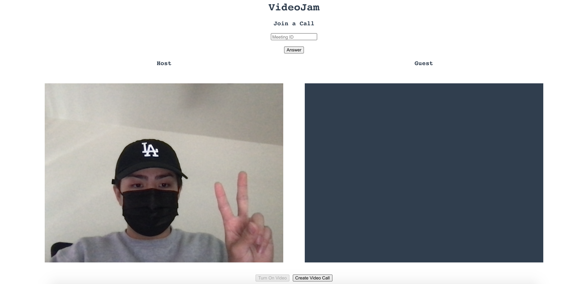
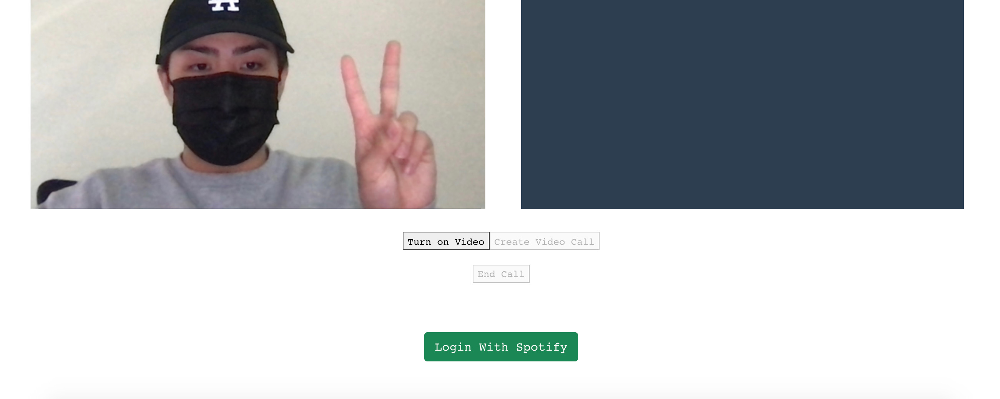
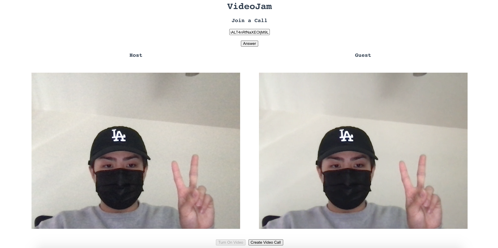
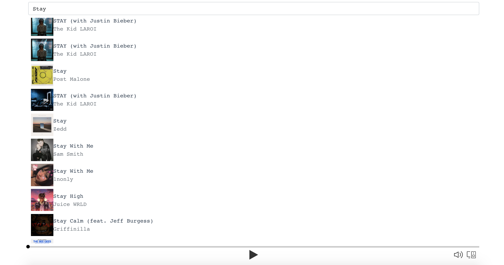
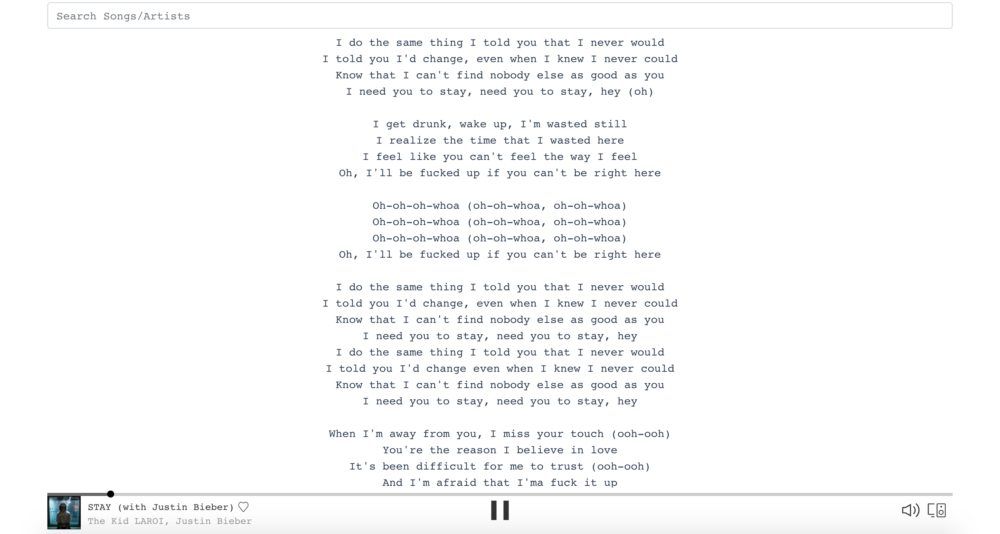
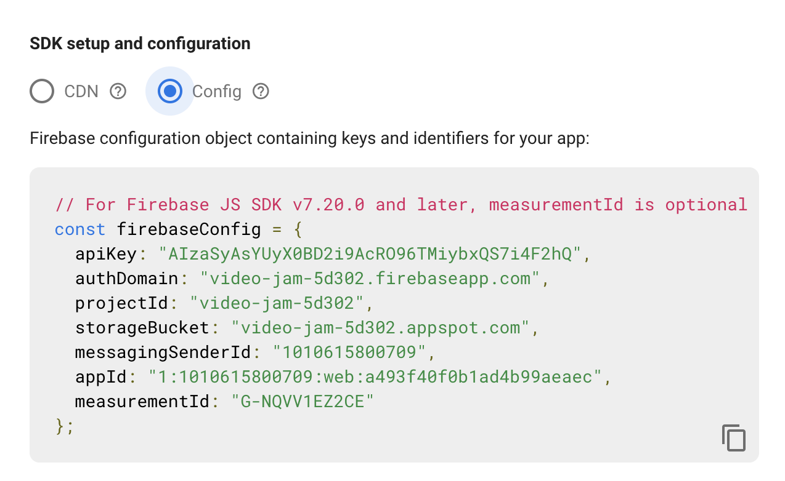

INTRODUCTION
-----------
VideoJam is a video chat app where users can communicate with each others and
share music within each other. When songs are selected, lyrics appear on screen
for group karaoke sessions and overall creating a fun time!

### Built With
* [JavaScript](https://www.javascript.com/)
* [Node](https://nodejs.org/en/)
* [React](https://reactjs.org/)
* [WebRTC](https://webrtc.org/)
* [Spotify Web API](https://developer.spotify.com/documentation/web-api/)
* [Firebase](https://firebase.google.com/)

DEMO
------
### Features
* Turn on video/audio
* Create a meeting
* Join a meeting
* End a meeting
* Log in with Spotify
* Search for songs/artists 
* Play/pause music
* Skip through music
* Follow lyrics

When you first launch up the app, you will be greeted with a screen down below. 
Click the **Turn On Video** button to access other features.
If you scroll down, you will also have the feature to sign in with your Spotify account.


<br>


After turning on your camera, you can then **Create a Call**.
A meeting ID will appear at the top in which you can then share with other users.
Users will use this ID and click the **Join Meeting** button to join the call.



Now that your video call is running, you may scroll down and search for songs or artists after authenticating with Spotify.



Once you find a song, you may click on it, and it will begin playing for everyone in the call.
Lyrics will also appear at the bottom of the screen to sing along to. 



SETUP
------
1. Clone this repository using the following command

* ```git clone https://github.com/dpayba/VideoJam.git```

2. Initialize a Firebase firestore database. You must first create an account and project. Then save your config.
   


3. Navigate to the ```VideoChat.js``` file and replace ```firebaseConfig``` with your configuration
4. Go to the [Spotify Developers Page](https://developer.spotify.com/) and access your dashboard.
5. Login and create an app. Save your **client id** and **client secret**.
6. Replace the ```clientId``` and ```clientSecret``` variables in the ```Dashboard.js``` and ```server.js``` files accordingly.
7. Install dependencies
* ```cd server```
* ```npm install```
* ```cd ../client```
* ```npm install```

USAGE
-----
To run the application, you must run both the client and server simultaneously.

**For Client:**
* ```cd client```
* ```npm start```

**For Server:**
* ```cd server```
* ```npm run devStart```

You should now be able to see the landing page and access **VideoJam's** features. Enjoy!

